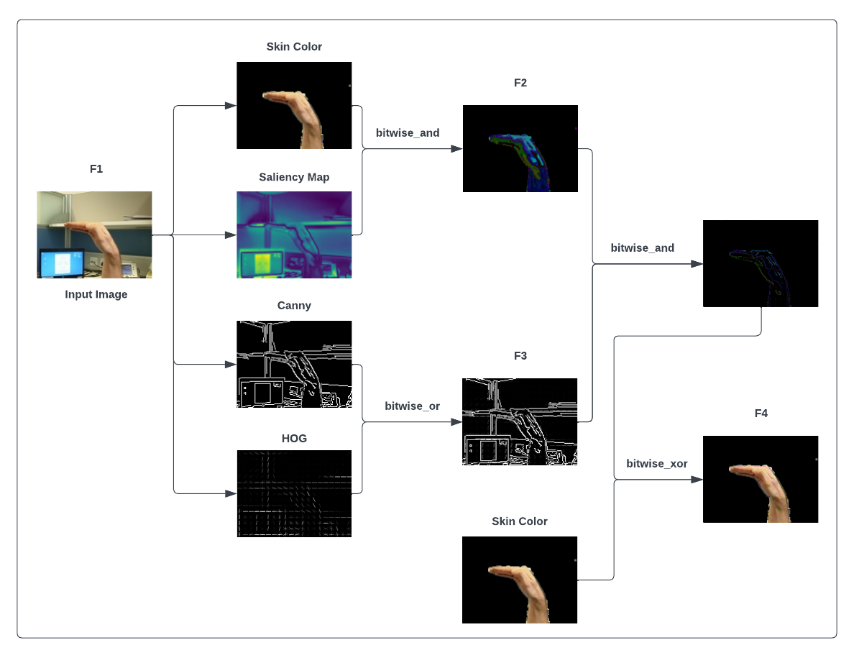

# Projekt Wizja Komputerowa

**Temat projektu:** Rozpoznawanie gestów dłoni

**Autorzy:** Maciej Bik, Kamil Buszta,  Wiktor Cioch, Arkadiusz Cios

---

# Opis kroków preprocesingu - rozpoznawanie gestów dłoni

---

## Idea ogólna

Metoda opiera się na ekstrakcji cech ze zdjęć dłoni, łączy cztery rodzaje informacji wizualnej za pomocą operatorów bitowych. Dzięki temu model jest w stanie odfiltrować skomplikowane tło i skupić się wyłącznie na kształcie dłoni, nawet jeśli kolory skóry, oświetlenie i tło są różne.

Inspiracja: Jafari F., Basu A., *"Saliency-Driven Hand Gesture Recognition Incorporating Histogram of Oriented Gradients (HOG) and Deep Learning"*, Sensors 2023, 23, 7790.

Z każdego obrazu wejściowego (przeskalowanego do rozmiaru 64×64 pikseli) wyznaczane są cztery mapy cech:

| Mapa | Znaczenie |
|-----------|-----------|
| **F1**  | Oryginalny obraz w skali szarości |
| **F2**  | Kolor skóry AND mapa saliencji |
| **F3**  | Krawędzie Canny'ego OR gradienty HOG |
| **F4** | Kształt dłoni doprecyzowany przez kolor skóry |

Mapy F2, F3, F4 są następnie składane w trójkanałowy obraz i przekazywane do klasyfikatora SVM.



---


### Funkcja `_skin_mask` - maska koloru skóry (F_SC)

```python
def _skin_mask(img: np.ndarray) -> np.ndarray:
```
Funkcja przyjmuje obraz BGR i zwraca binarną maskę pikseli należących do obszaru skóry.

```python
    hsv = cv2.cvtColor(img, cv2.COLOR_BGR2HSV)
```
Konwertuje obraz z przestrzeni barw **BGR** (domyślna w OpenCV) na **HSV** (Hue–Saturation–Value). Przestrzeń HSV jest bardziej odporna na zmiany oświetlenia niż RGB/BGR: odcień (H) koduje kolor niezależnie od jasności (V), co ułatwia detekcję koloru skóry przy różnych warunkach oświetleniowych.

```python
    lo, hi = np.array([0, 15, 0]), np.array([17, 170, 255])
```
Definiuje **dolną** i **górną** granicę zakresu HSV odpowiadającego kolorowi skóry ludzkiej:
- `H` (odcień): 0–17 - zakres pomarańczowo-żółtawych odcieni charakterystycznych dla skóry.
- `S` (nasycenie): 15–170 - wyklucza piksele prawie białe (niskie S) i bardzo intensywnie zabarwione (wysokie S).
- `V` (jasność): 0–255 - akceptuje całą gamę jasności.

Wartości zostały dobrane na podstawie: *"Zero-sum game theory model for segmenting skin regions", Djamila Dahmani, Mehdi Cheref et. al.*

```python
    return cv2.inRange(hsv, lo, hi)
```
Zwraca binarną maskę: piksel przyjmuje wartość **255** (biały), jeśli jego wartości HSV mieszczą się między `lo` a `hi`, w przeciwnym razie **0** (czarny). W ten sposób białe obszary maski odpowiadają pikselom skóry.

---

### Funkcja `_saliency_u8` - mapa saliencji (F_S)

```python
def _saliency_u8(img: np.ndarray) -> np.ndarray:
```
Funkcja wyznacza **mapę saliencji** - obraz pokazujący, które obszary obrazu są wizualnie najbardziej wyróżniające się (najbardziej "przyciągają wzrok"). (https://en.wikipedia.org/wiki/Saliency_map)


```python
    saliency = cv2.saliency.StaticSaliencyFineGrained_create()
```
Tworzy obiekt algorytmu saliencji statycznej wysokiej rozdzielczości (`StaticSaliencyFineGrained`). Algorytm ten analizuje lokalne kontrasty kolorystyczne i jasności w każdym punkcie obrazu, przypisując każdemu pikselowi wartość "wyróżnienia" w zakresie 0-1.

```python
    _, sal_map = saliency.computeSaliency(img)
```
Oblicza mapę saliencji. Metoda zwraca krotkę `(sukces, mapa)` - operator `_` ignoruje flagę sukcesu. `sal_map` to macierz float32 o wartościach z zakresu [0.0, 1.0], gdzie wartości bliskie 1 oznaczają obszary bardzo wyróżniające się (np. dłoń na tle).

```python
    return (sal_map * 255).astype(np.uint8)
```
Skaluje wartości z zakresu [0.0, 1.0] do zakresu [0, 255] i konwertuje do 8-bitowych liczb całkowitych (`uint8`). Jest to konieczne, by mapa saliencji miała ten sam format co pozostałe obrazy i można było na niej wykonywać operacje bitowe.

---

### Funkcja `_hog_image` — wizualizacja HOG (F_HOG)

```python
def _hog_image(img: np.ndarray) -> np.ndarray:
```
Funkcja oblicza **Histogramy Zorientowanych Gradientów (HOG)** i zwraca jego wizualizację jako obraz uint8. HOG opisuje lokalną strukturę kształtu poprzez rozkład kierunków gradientów jasności - jest szczególnie skuteczny w kodowaniu konturów i tekstury dłoni.
(https://en.wikipedia.org/wiki/Histogram_of_oriented_gradients)

```python
    gray = cv2.cvtColor(img, cv2.COLOR_BGR2GRAY)
```
Konwertuje obraz kolorowy BGR do skali szarości.

```python
    _, hog_vis = hog(gray, orientations=9, pixels_per_cell=(8, 8),
                     cells_per_block=(2, 2), visualize=True)
```
Parametry wzięte z (https://lear.inrialpes.fr/people/triggs/pubs/Dalal-cvpr05.pdf)

```python
    if hog_vis.max() > 0:
        return (hog_vis / hog_vis.max() * 255).astype(np.uint8)
    return np.zeros_like(gray, dtype=np.uint8)
```
Normalizuje wizualizację HOG do zakresu [0, 255]. Warunek `hog_vis.max() > 0` chroni przed dzieleniem przez zero w przypadku zerowego gradientu obrazu, wtedy zwracany jest pusty (czarny) obraz o tym samym rozmiarze co wejściowy.

---

### Funkcja `extract_features` - integracja cech (F1, F2, F3, F4)

```python
def extract_features(img: np.ndarray) -> Tuple[np.ndarray, np.ndarray, np.ndarray, np.ndarray]:
```
Główna funkcja preprocesingu. Przyjmuje obraz BGR i zwraca krotkę czterech map cech (F1, F2, F3, F4), wszystkich w formacie uint8 o rozmiarze 64×64.

```python
    img = cv2.resize(img, _IMG_SIZE)
```
Skaluje obraz wejściowy do rozmiaru 64x64 piksele. Jest to wymagane przez architekturę modelu — wszystkie obrazy muszą mieć identyczny rozmiar. Domyślna metoda interpolacji OpenCV (`INTER_LINEAR`) zapewnia płynne przeskalowanie.

```python
    gray = cv2.cvtColor(img, cv2.COLOR_BGR2GRAY)
```
Konwertuje przeskalowany obraz do skali szarości. Wynik jest używany bezpośrednio jako F1 oraz jako wejście do detekcji krawędzi Canny'ego i obliczania HOG.

```python
    skin  = _skin_mask(img)
```
Wywołuje funkcję `_skin_mask` i uzyskuje binarną maskę skóry: białe piksele = skóra, czarne = tło.

```python
    sal   = _saliency_u8(img)
```
Wywołuje funkcję `_saliency_u8` i uzyskuje mapę saliencji jako obraz uint8 w skali szarości.

```python
    canny = cv2.Canny(gray, 50, 150)
```
Stosuje detektor krawędzi Canny'ego (https://pl.wikipedia.org/wiki/Canny) na obrazie w skali szarości. Parametry:
- `50` - dolny próg: krawędzie o gradiencie poniżej tej wartości są odrzucane.
- `150` - górny próg: krawędzie o gradiencie powyżej tej wartości są zawsze akceptowane.

Krawędzie o gradiencie między 50 a 150 są akceptowane tylko jeśli sąsiadują z krawędzią (> 150). Wynikiem jest binarna mapa krawędzi (0 lub 255).

```python
    hog_img = _hog_image(img)
```
Wywołuje funkcję `_hog_image` i uzyskuje wartość energii gradientów HOG jako obraz uint8.

---

#### Składanie map cech operatorami bitowymi

```python
    F1 = gray
```
F1 to oryginalny obraz w skali szarości 
```python
    F2 = cv2.bitwise_and(skin, sal)
```
F2 jest zdefiniowane bitową operacją AND na masce skóry i mapie saliencji. Piksel w F2 jest jasny tylko wtedy, gdy jest jednocześnie obszarem skóry* (skin > 0) i obszarem wizualnie wyróżniającym się (sal > 0). Eliminuje to fałszywe detekcje skóry w tle i skupia uwagę na rzeczywistej dłoni.

```python
    F3 = cv2.bitwise_or(canny, hog_img)
```
F3 jest zdefiniowane bitową operacją OR na mapie krawędzi Canny'ego i wizualizacji HOG. Piksel w F3 jest jasny jeśli wykryto w nim krawędź lub gradient kierunkowy.

```python
    F4 = cv2.bitwise_xor(cv2.bitwise_and(F2, F3), skin)
```
F4 jest obliczana w dwóch krokach:

1. `cv2.bitwise_and(F2, F3)` - AND między F2 i F3

2. `cv2.bitwise_xor(..., skin)` - XOR wyniku powyższego z oryginalną maską skóry.

```python
    return F1, F2, F3, F4
```
Zwraca wszystkie cztery mapy cech jako krotkę tablic numpy uint8 o rozmiarze 64×64.


## Główna funkcja odpowiedzialna za przetwarzanie obrazu
#### `process_image`

```python
    @staticmethod
    def process_image(payload: MethodPayload) -> np.ndarray:
        _, F2, F3, F4 = extract_features(payload.image)
        return np.stack([F2, F3, F4], axis=-1)
```
Wywołuje `extract_features`, pomija F1 (operator `_`) i składa F2, F3, F4 w **trójkanałowy obraz 64×64×3** za pomocą `np.stack(..., axis=-1)`. Każdy kanał to jedna mapa cech — Ten tensor jest wejściem do klasyfikatora.
